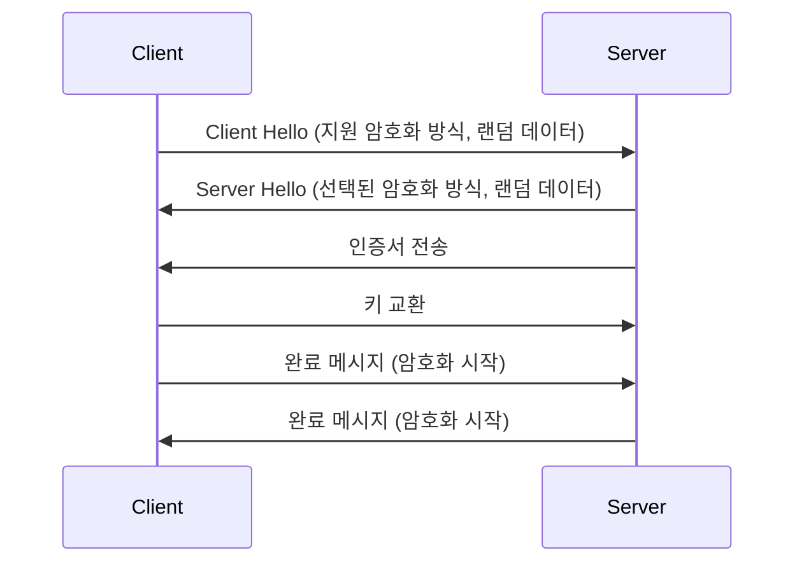

# TLS와 SSL의 역할과 원리

TLS(Transport Layer Security)와 SSL(Secure Sockets Layer)은 인터넷 통신의 보안을 담당하는 암호화 프로토콜입니다. SSL은 초기 버전이며, TLS는 SSL의 후속 버전입니다. 현재 대부분의 시스템은 TLS를 사용합니다.

## 주요 기능

1. **데이터 암호화**: 통신 내용을 제3자가 읽을 수 없도록 암호화
2. **데이터 무결성**: 전송 중 데이터 변조 방지
3. **인증**: 통신 상대방의 신원 확인

## 동작 원리

### 1. 핸드셰이크 과정



1. **Client Hello**: 클라이언트가 지원하는 암호화 방식과 랜덤 데이터 전송
2. **Server Hello**: 서버가 선택한 암호화 방식과 랜덤 데이터 응답
3. **인증서 전송**: 서버가 자신의 디지털 인증서 전송
4. **키 교환**: 클라이언트가 세션 키 생성에 필요한 정보 전송
5. **완료 메시지**: 양측이 암호화된 완료 메시지를 교환하여 핸드셰이크 종료

### 2. 데이터 전송

- 협상된 세션 키로 데이터를 암호화하여 전송
- 각 메시지에 MAC(Message Authentication Code) 첨부로 무결성 보장

### 3. 연결 종료

- `close_notify` 경고 메시지로 연결 종료

## 주요 개념

1. **대칭 키 암호화**: 동일한 키로 암호화와 복호화 수행 (예: AES)
2. **비대칭 키 암호화**: 공개 키와 개인 키 쌍 사용 (예: RSA)
3. **디지털 인증서**: CA(Certificate Authority)가 발급한 서버 신원 증명서
4. **HMAC**: 메시지 무결성을 검증하는 코드

## TLS 버전 비교

| 버전 | 주요 특징 | 지원 상태 |
|------|-----------|-----------|
| TLS 1.0 | SSL 3.0 기반, 취약점 존재 | 사용 권장하지 않음 |
| TLS 1.1 | IV 공격 방어 개선 | 사용 권장하지 않음 |
| TLS 1.2 | SHA-256 지원, 보안 강화 | 널리 사용됨 |
| TLS 1.3 | 핸드셰이크 최적화, 0-RTT | 최신 버전, 권장됨 |

## 구현 예시 (Node.js)

```javascript
const https = require('https');
const fs = require('fs');

const options = {
  key: fs.readFileSync('key.pem'),
  cert: fs.readFileSync('cert.pem'),
  ciphers: 'TLS_AES_256_GCM_SHA384:TLS_CHACHA20_POLY1305_SHA256',
  minVersion: 'TLSv1.2'
};

https.createServer(options, (req, res) => {
  res.writeHead(200);
  res.end('Hello, secure world!');
}).listen(443);
```

## 보안 고려사항

1. **최신 TLS 버전 사용**: TLS 1.2 이상 권장
2. **강력한 암호화 스위트 선택**: 예) `TLS_AES_256_GCM_SHA384`
3. **인증서 갱신**: 주기적인 인증서 갱신 및 관리
4. **Perfect Forward Secrecy (PFS) 지원**: 키 노출 시 과거 통신 보호
5. **HSTS (HTTP Strict Transport Security) 적용**: HTTPS 강제 사용

## 디버깅 도구

- **OpenSSL**: 인증서 검증 및 연결 테스트

  ```bash
  openssl s_client -connect example.com:443 -tls1_2
  ```

- **Wireshark**: TLS 트래픽 분석
- **SSLLabs**: 웹 서버 TLS 설정 검사

## 결론

TLS/SSL은 현대 인터넷 보안의 근간을 이루는 프로토콜입니다. 지속적인 보안 업데이트와 최신 버전 사용이 중요하며, 올바른 구현을 통해 안전한 데이터 통신을 보장할 수 있습니다. 개발자는 TLS의 기본 원리를 이해하고, 적절한 구현과 주기적인 보안 점검을 수행해야 합니다.
