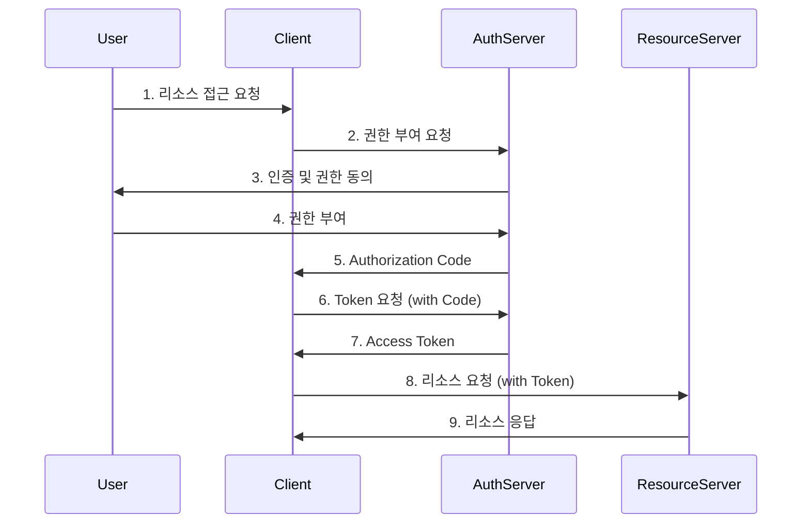
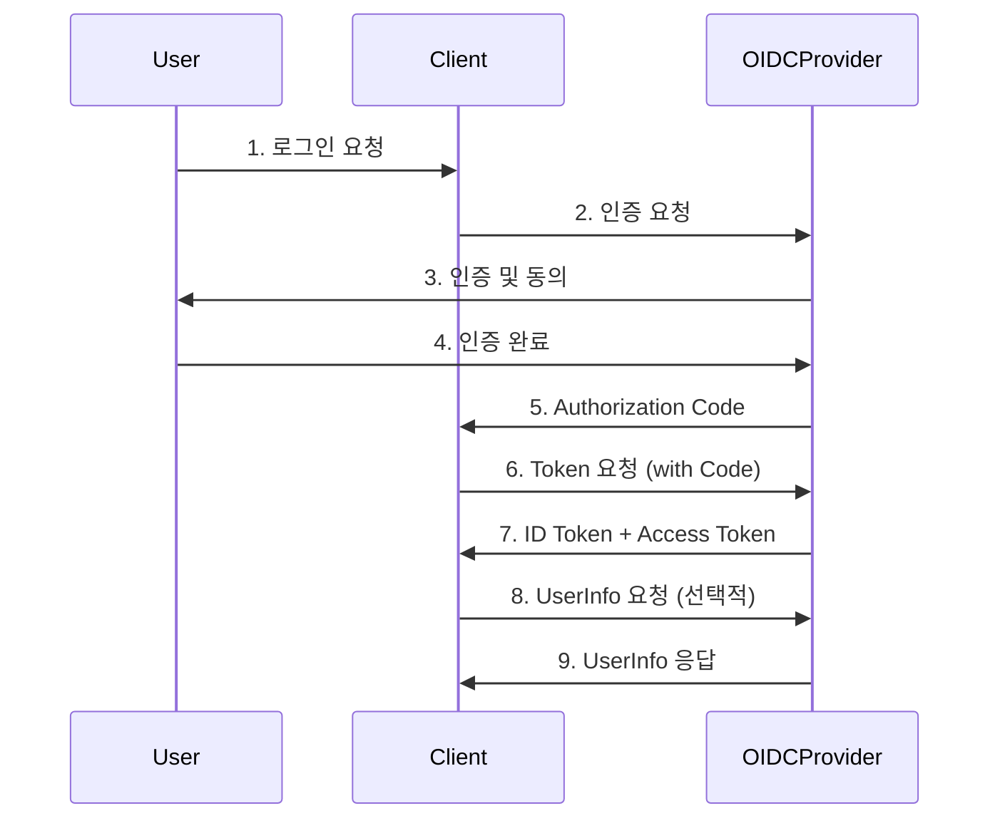

# OAuth와 OpenID Connect의 차이점

OAuth와 OpenID Connect는 모두 인증 및 권한 부여를 위한 프로토콜이지만, 각각의 목적과 기능에 차이가 있습니다.

## 간단 비교표

| 특징 | OAuth 2.0 | OpenID Connect |
|------|-----------|----------------|
| 주요 목적 | 권한 부여 (Authorization) | 인증 (Authentication) |
| 토큰 유형 | Access Token | ID Token + Access Token |
| 사용자 정보 | 별도의 API 호출 필요 | ID Token에 포함 |
| 표준화 수준 | 낮음 (구현에 따라 다름) | 높음 (명확한 규격) |
| 주요 사용 사례 | API 접근 권한 관리 | 사용자 로그인, SSO |

## OAuth 2.0

OAuth 2.0은 애플리케이션이 사용자의 리소스에 접근할 수 있는 권한을 부여하는 프로토콜입니다.

### 주요 특징

1. 권한 부여에 중점
2. Access Token 사용
3. 리소스 서버에 대한 권한 관리

### 주요 흐름 (Authorization Code Grant)



### OAuth 구현 예시 (Node.js)

```javascript
const express = require('express');
const axios = require('axios');
const app = express();

app.get('/oauth/callback', async (req, res) => {
  const { code } = req.query;
  const tokenResponse = await axios.post('https://oauth-provider.com/token', {
    code,
    client_id: 'YOUR_CLIENT_ID',
    client_secret: 'YOUR_CLIENT_SECRET',
    grant_type: 'authorization_code'
  });

  const accessToken = tokenResponse.data.access_token;
  // Access Token을 사용하여 리소스 서버에 요청
});

app.listen(3000);
```

## OpenID Connect

OpenID Connect는 OAuth 2.0 위에 구축된 인증 계층으로, 사용자 인증에 중점을 둡니다.

### OpenID Connect 주요 특징

1. 사용자 인증에 중점
2. ID Token (JWT) 사용
3. 표준화된 사용자 정보 제공

### 주요 흐름



### 구현 예시 (Node.js)

```javascript
const express = require('express');
const { Issuer } = require('openid-client');
const app = express();

app.get('/login', async (req, res) => {
  const issuer = await Issuer.discover('https://accounts.google.com');
  const client = new issuer.Client({
    client_id: 'YOUR_CLIENT_ID',
    client_secret: 'YOUR_CLIENT_SECRET',
    redirect_uris: ['http://localhost:3000/callback'],
    response_types: ['code'],
  });

  const authUrl = client.authorizationUrl({
    scope: 'openid email profile',
  });
  res.redirect(authUrl);
});

app.get('/callback', async (req, res) => {
  // ... 토큰 교환 및 ID Token 검증 로직
});

app.listen(3000);
```

## 주요 차이점

1. **목적**: OAuth는 권한 부여, OpenID Connect는 인증에 중점
2. **토큰**: OAuth는 Access Token만 사용, OpenID Connect는 ID Token 추가
3. **사용자 정보**: OpenID Connect는 표준화된 방식으로 사용자 정보 제공
4. **흐름**: OpenID Connect는 OAuth 2.0 흐름에 인증 단계 추가

## 사용 시 고려사항

1. **보안**: HTTPS 사용, 토큰 안전한 저장, CSRF 방지
2. **범위(Scope) 관리**: 필요한 최소한의 권한만 요청
3. **토큰 관리**: 적절한 만료 시간 설정, 갱신 토큰 사용
4. **에러 처리**: 인증/권한 부여 실패 시 적절한 처리

## 결론

OAuth 2.0은 권한 부여에, OpenID Connect는 사용자 인증에 특화되어 있습니다. 애플리케이션의 요구사항에 따라 적절한 프로토콜을 선택하거나 두 프로토콜을 조합하여 사용할 수 있습니다. 보안 및 사용자 경험을 고려하여 신중하게 구현해야 합니다.
