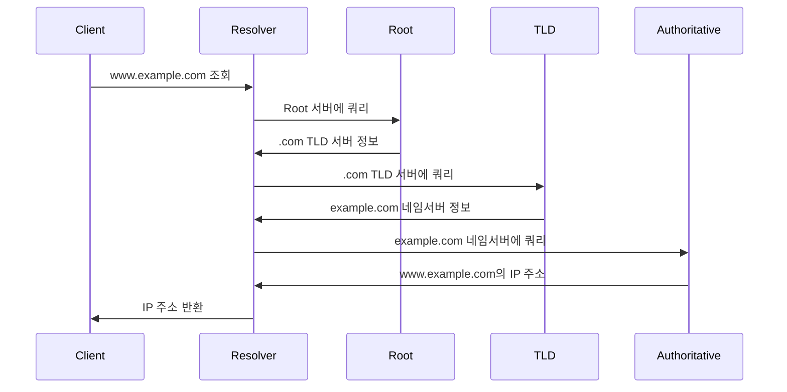

# DNS의 작동 원리

DNS(Domain Name System)는 도메인 이름을 IP 주소로 변환하는 분산 데이터베이스 시스템입니다. 이는 사용자가 기억하기 쉬운 도메인 이름을 사용하여 웹사이트에 접속할 수 있게 해줍니다.

## DNS 구성 요소

1. **DNS Resolver (리졸버)**: 클라이언트의 DNS 쿼리를 처리하는 첫 번째 단계
2. **Root Nameservers**: DNS 계층 구조의 최상위 서버
3. **TLD Nameservers**: .com, .org 등의 최상위 도메인 서버
4. **Authoritative Nameservers**: 특정 도메인의 DNS 레코드를 보유한 서버

## DNS 조회 과정



1. 클라이언트가 DNS Resolver에 쿼리 전송
2. Resolver가 Root Nameserver에 쿼리
3. Root Nameserver가 TLD Nameserver 정보 제공
4. Resolver가 TLD Nameserver에 쿼리
5. TLD Nameserver가 Authoritative Nameserver 정보 제공
6. Resolver가 Authoritative Nameserver에 쿼리
7. Authoritative Nameserver가 IP 주소 제공
8. Resolver가 클라이언트에 IP 주소 반환

## DNS 레코드 유형

- **A (Address)**: 도메인 이름을 IPv4 주소에 매핑
- **AAAA**: 도메인 이름을 IPv6 주소에 매핑
- **CNAME (Canonical Name)**: 도메인 별칭
- **MX (Mail Exchanger)**: 메일 서버 지정
- **TXT**: 텍스트 정보 저장 (SPF, DKIM 등)
- **NS (Name Server)**: 도메인의 네임서버 지정

## DNS 캐싱

DNS 성능 향상을 위해 여러 레벨에서 캐싱이 이루어집니다:

- **브라우저 캐시**: 클라이언트 측 캐싱
- **OS 캐시**: 운영 체제 레벨의 캐싱
- **Resolver 캐시**: DNS Resolver의 캐싱
- **ISP 캐시**: 인터넷 서비스 제공자의 캐싱

## DNS 관련 명령어 (Linux/macOS)

```bash
# 도메인 조회
dig example.com

# 특정 레코드 타입 조회
dig example.com MX

# DNS 조회 과정 추적
dig +trace example.com

# 역방향 DNS 조회
dig -x 192.0.2.1

# nslookup 사용 (Windows에서도 사용 가능)
nslookup example.com
```

## DNS 보안

1. **DNSSEC (DNS Security Extensions)**
   - 디지털 서명을 사용하여 DNS 데이터의 진정성과 무결성 보장

2. **DNS over HTTPS (DoH)**
   - HTTPS를 통해 DNS 쿼리를 암호화하여 전송

3. **DNS over TLS (DoT)**
   - TLS를 사용하여 DNS 쿼리를 암호화

## 구현 예시 (Python)

```python
import dns.resolver

def dns_lookup(domain, record_type='A'):
    try:
        answers = dns.resolver.resolve(domain, record_type)
        for rdata in answers:
            print(f"{domain} has {record_type} record: {rdata}")
    except dns.resolver.NXDOMAIN:
        print(f"{domain} does not exist")
    except dns.resolver.NoAnswer:
        print(f"No {record_type} record found for {domain}")
    except dns.exception.DNSException as e:
        print(f"DNS query failed: {e}")

# 사용 예
dns_lookup('example.com', 'A')
dns_lookup('example.com', 'MX')
```

## 성능 최적화 팁

1. **TTL(Time to Live) 최적화**: 적절한 TTL 설정으로 캐싱 효율 향상
2. **CDN 활용**: 콘텐츠 전송 네트워크를 통한 DNS 조회 시간 단축
3. **DNS Prefetching**: 브라우저에서 DNS 사전 조회 활용
4. **anycast DNS**: 지리적으로 분산된 DNS 서버 사용

## 결론

DNS는 인터넷의 핵심 인프라로, 도메인 이름을 IP 주소로 변환하는 중요한 역할을 수행합니다. 효율적인 DNS 구성과 관리는 웹사이트의 성능과 가용성에 직접적인 영향을 미치므로, 개발자와 시스템 관리자는 DNS의 작동 원리와 최적화 방법을 잘 이해해야 합니다.
