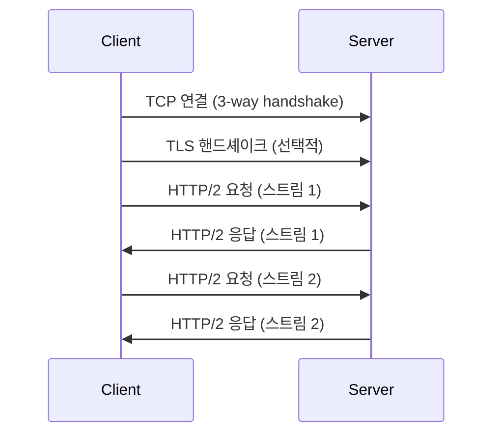
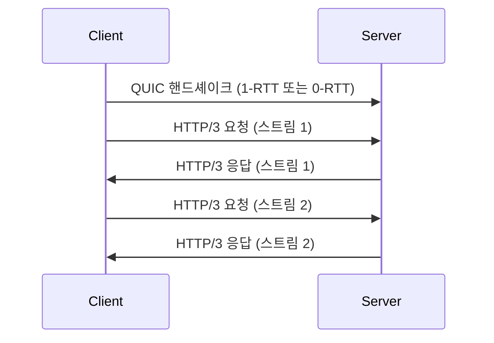

# HTTP/2와 HTTP/3의 차이

HTTP/2와 HTTP/3는 웹 성능을 향상시키기 위해 개발된 최신 HTTP 프로토콜 버전입니다. 두 프로토콜은 기존 HTTP/1.1의 한계를 극복하고자 하지만, 접근 방식에서 중요한 차이가 있습니다.

## 주요 차이점 요약

| 특징 | HTTP/2 | HTTP/3 |
|------|--------|--------|
| 기반 프로토콜 | TCP | QUIC (UDP 기반) |
| 연결 설정 | TCP 3-way handshake | 0-RTT or 1-RTT |
| 멀티플렉싱 | 스트림 기반 | 스트림 기반 (개선됨) |
| 헤더 압축 | HPACK | QPACK |
| 암호화 | TLS 선택적 | 기본 암호화 (QUIC 내장) |
| HOL 블로킹 | TCP 레벨에서 발생 가능 | 스트림 레벨에서 해결 |

## HTTP/2 주요 특징

1. **멀티플렉싱**: 단일 TCP 연결에서 여러 요청/응답 동시 처리
2. **헤더 압축 (HPACK)**: 중복 헤더 정보 제거로 효율성 향상
3. **서버 푸시**: 클라이언트 요청 전 리소스 선제적 전송
4. **스트림 우선순위**: 리소스 로딩 최적화



## HTTP/3 주요 특징

1. **QUIC 프로토콜**: UDP 기반, 빠른 연결 설정
2. **내장 암호화**: TLS 1.3 기본 포함
3. **개선된 멀티플렉싱**: 스트림 단위 독립적 처리
4. **연결 마이그레이션**: 네트워크 변경 시 연결 유지



## 성능 비교

1. **연결 설정**: HTTP/3가 더 빠름 (0-RTT 또는 1-RTT)
2. **네트워크 변화 대응**: HTTP/3가 우수 (연결 마이그레이션)
3. **패킷 손실 처리**: HTTP/3가 효율적 (독립적 스트림 처리)

## 구현 예시 (Node.js)

### HTTP/2 서버

```javascript
const http2 = require('http2');
const fs = require('fs');

const server = http2.createSecureServer({
  key: fs.readFileSync('server.key'),
  cert: fs.readFileSync('server.crt')
});

server.on('stream', (stream, headers) => {
  stream.respond({
    'content-type': 'text/html',
    ':status': 200
  });
  stream.end('<h1>Hello World</h1>');
});

server.listen(8443);
```

### HTTP/3 서버 (실험적)

```javascript
const { createQuicSocket } = require('net');
const { key, cert } = require('crypto').generateKeyPairSync('rsa', {
  modulusLength: 2048,
});

const server = createQuicSocket({ key, cert });

server.listen({ port: 8443 });

server.on('session', (session) => {
  session.on('stream', (stream) => {
    stream.end('Hello World');
  });
});
```

## 채택 시 고려사항

1. **호환성**: HTTP/3는 상대적으로 새로워 지원 범위 확인 필요
2. **방화벽 설정**: UDP 트래픽 허용 필요 (HTTP/3)
3. **모니터링**: 새로운 프로토콜에 맞는 모니터링 도구 필요
4. **성능 테스트**: 실제 환경에서의 성능 이점 검증 필요

## 결론

HTTP/2와 HTTP/3는 모두 웹 성능을 크게 향상시키지만, HTTP/3는 더 근본적인 변화를 통해 추가적인 이점을 제공합니다. 특히 불안정한 네트워크 환경에서 HTTP/3의 장점이 두드러집니다. 그러나 새로운 기술 도입에 따른 호환성과 구현 복잡성을 고려해야 합니다. 프로젝트의 요구사항과 대상 사용자 환경을 고려하여 적절한 프로토콜을 선택하는 것이 중요합니다.
