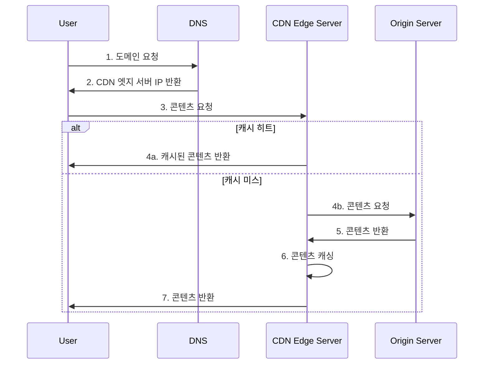

# 개발자를 위한 CDN (Content Delivery Network) 개요

CDN은 지리적으로 분산된 서버 네트워크를 통해 웹 콘텐츠를 효율적으로 전달하는 시스템입니다. 웹 애플리케이션의 성능, 가용성, 보안을 향상시키는 핵심 인프라입니다.

## 주요 기능

1. **콘텐츠 캐싱**: 원본 서버의 부하 감소, 응답 시간 단축
2. **지리적 분산**: 사용자와 가까운 서버에서 콘텐츠 제공
3. **부하 분산**: 트래픽을 여러 서버에 분산
4. **보안 강화**: DDoS 방어, SSL/TLS 암호화, WAF 제공
5. **동적 콘텐츠 최적화**: 실시간 압축, 이미지 최적화

## 작동 원리



## 구현 예시 (Cloudflare 사용)

1. **DNS 설정**:

   ```text
   example.com.   IN  A     192.0.2.1
   example.com.   IN  CNAME example.com.cdn.cloudflare.net
   ```

2. **원본 서버 설정** (Nginx):

   ```nginx
   server {
       listen 80;
       server_name example.com;
       
       location / {
           proxy_set_header Host $host;
           proxy_set_header X-Real-IP $remote_addr;
           proxy_pass http://backend_server;
       }
   }
   ```

3. **캐시 제어 헤더 설정**:

   ```http
   Cache-Control: public, max-age=3600
   ```

## 성능 최적화 팁

1. **적절한 캐시 TTL 설정**: 콘텐츠 유형에 따라 최적화
2. **압축 활성화**: Gzip/Brotli 사용으로 전송 크기 감소
3. **이미지 최적화**: WebP 형식 사용, 적절한 크기 조정
4. **HTTP/2 활성화**: 멀티플렉싱으로 성능 향상
5. **프리페칭**: 예상되는 리소스 미리 로드

## 모니터링 및 분석

1. **실시간 트래픽 모니터링**: CDN 제공업체의 대시보드 활용
2. **캐시 적중률 (Hit Ratio) 분석**: 최적의 캐싱 전략 수립
3. **지역별 성능 분석**: 글로벌 사용자 경험 최적화
4. **오류 로그 분석**: 문제점 조기 발견 및 해결

## 보안 고려사항

1. **HTTPS 적용**: 모든 콘텐츠에 SSL/TLS 암호화 적용
2. **웹 애플리케이션 방화벽 (WAF)**: SQL 인젝션, XSS 등 공격 방어
3. **토큰 기반 인증**: 민감한 콘텐츠에 대한 접근 제어
4. **지리적 접근 제한**: 필요시 특정 지역 접근 차단

## 주요 CDN 제공업체 비교

| 제공업체 | 특징 | 추천 사용 사례 |
|---------|------|---------------|
| Cloudflare | 무료 플랜, DDoS 방어 | 소규모~중규모 웹사이트 |
| Amazon CloudFront | AWS 통합, 엣지 컴퓨팅 | AWS 기반 애플리케이션 |
| Akamai | 광범위한 글로벌 네트워크 | 대규모 엔터프라이즈 |
| Fastly | 실시간 퍼지, 엣지 컴퓨팅 | 동적 콘텐츠 중심 사이트 |

## 결론

CDN은 현대 웹 아키텍처의 필수 요소로, 성능 향상, 보안 강화, 가용성 증대에 크게 기여합니다. 개발자는 CDN의 특성을 이해하고 효과적으로 활용함으로써 더 빠르고 안정적인 웹 서비스를 구축할 수 있습니다. 적절한 CDN 선택과 최적화를 통해 글로벌 규모의 서비스나 대규모 트래픽을 효과적으로 처리할 수 있습니다.
